# 🏦 **Application de gestion des comptes bancaires**

## 📋 Sommaire

1. [Description](#-description)
2. [Fonctionnalités principales](#fonctionnalités-principales)
3. [Installation et démarrage](#-installation-et-démarrage)
4. [Structure du Projet](#structure-du-projet)
5. [Tests](#tests)
6. [Sécurity]
     

## **Description**

Backend d'une application web pour gérer des comptes bancaires, leurs clients et les opérations associées (CREDIT/DEBIT). L'application distingue deux types de comptes : Comptes Courants et Comptes Épargne.

## **Fonctionnalités principales**

- Gestion des clients (CRUD)
- Gestion des comptes bancaires (création, consultation)
- Exécution d'opérations (dépôt, retrait, virement)
- Consultation de l'historique des opérations
- Différenciation entre comptes courants et épargnes

### **1- Backend**

- **Spring Boot** 3.x
- **Spring Data JPA** (Hibernate)
- **Spring REST** (API RESTful)
- Base de données: **H2**
### **2- Modèle de données**
#### **diagramme de clase**

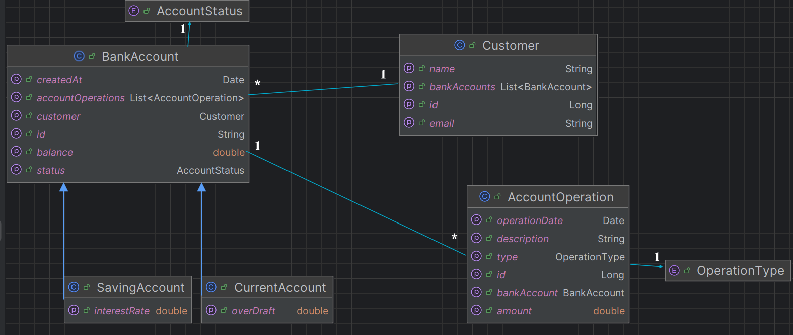

## 🚀 **Installation et démarrage**
1. Cloner le dépôt:

   ```bash
    git clone  https://github.com/d-sar/DigitalBanking.git
    cd DigitalBanking
   ```
2. Configurer la base de données (application.properties):

     ```java
      server.port=8085
      spring.datasource.url=jdbc:h2:mem:DigitalBanking-db
      spring.h2.console.enabled=true
      spring.datasource.username=root
      spring.datasource.password=
      ```
3. Lancer l'application:

     ```bash
      mvn spring-boot:run
      ```

## **Structure du Projet**
 ### 1- Couches de l'application
```bash
src/
├── main/
│   ├── java/ma/damri/digitalbanking_backend
│   │   ├── DTOs/       # Objets de transfert
│   │   ├── entities/   # Entités JPA
│   │   ├── exceptions/ # Gestion des exceptions
│   │   ├── mappers/    # Couche service
│   │   ├── Repository/ # Interfaces Spring Data
│   │   ├── Services/   # Couche service
│   │   ├── web/        # Contrôleurs REST      
│   │   └── DigitalBankingBackendApplication.java  # Classe principale
│   └── resources/
│       ├── static/
│       ├── templates/
│       └── application.properties
└── test/                
```
### 2- Entités principales

1. **Customer (Client)**
      - id, name, email, bankAccounts.
2. **BankAccount**
      * id, balance, createdAt, status(CREATED/ACTIVATED/SUSPENDED), customer, accountOperations.
3. **CurrentAccount (Compte Courant)**
     * overDraft.
4. **SavingAccount (Compte Épargne)**
    * interestRate.
5. **AccountOperation**
   * id, operationDate, amount, type(CREDIT/DEBIT), description, bankAccount.

### 3- API Endpoints
**/customers**

| Type   | Endpoint                | Action                          |
|--------|-------------------------|---------------------------------|
| GET    | /customers              | 	Lister tous les clients        |
| POST   | /customers              | Créer un nouveau client         |
| GET    | /accounts/{id}          | Obtenir les détails d'un compte |
| PUT    | /customers/{customerId} | update un client                |
| Delete | /customers/{id}         | Supprimer un client             |

**/accounts**

| Type  | Endpoint                  | Action          |
|-------|---------------------------|-----------------|
| GET   | /accounts                 | 	Lister comptes |
| GET   | /accounts/{id}            | Détails compte  |
| GET   | /accounts/{id}/operations | Voir opérations |
| POST  | /accounts/debit           | Retrait         |
| POST  | 	/accounts/credit         | Dépôt           |
| POST  | /accounts/transfer        | Virement        | 


## **Tests**
### **1- Tester la couche Repository**
```java
@Bean
CommandLineRunner start(CustomerRepository customerRepository,
BankAccountRepository bankAccountRepository,
AccountOperationRepository accountOperationRepository){
//Création de clients
return args -> {
Stream.of("Ahmed","Ali","Laila").forEach(name->{
               Customer customer=new Customer();
               customer.setName(name);
               customer.setEmail(name+"@gmail.com");
               customerRepository.save(customer);
               });
               //Création de comptes courants et épargne pour chaque client
               customerRepository.findAll().forEach(cust->{
               CurrentAccount currentAccount=new CurrentAccount();
               currentAccount.setId(UUID.randomUUID().toString());
               currentAccount.setBalance(Math.random()*90000);
               currentAccount.setCreatedAt(new Date());
               currentAccount.setStatus(AccountStatus.CREATED);
               currentAccount.setCustomer(cust);
               currentAccount.setOverDraft(9000);
               bankAccountRepository.save(currentAccount);

                SavingAccount savingAccount=new SavingAccount();
                savingAccount.setId(UUID.randomUUID().toString());
                savingAccount.setBalance(Math.random()*90000);
                savingAccount.setCreatedAt(new Date());
                savingAccount.setStatus(AccountStatus.CREATED);
                savingAccount.setCustomer(cust);
                savingAccount.setInterestRate(5.5);
                bankAccountRepository.save(savingAccount);

            });
            //Création de 10 opérations bancaires par compte
            bankAccountRepository.findAll().forEach(acc->{
                for (int i = 0; i <10 ; i++) {
                    AccountOperation accountOperation=new AccountOperation();
                    accountOperation.setOperationDate(new Date());
                    accountOperation.setAmount(Math.random()*12000);
                    accountOperation.setType(Math.random()>0.5? OperationType.DEBIT: OperationType.CREDIT);
                    accountOperation.setBankAccount(acc);
                    accountOperationRepository.save(accountOperation);
                }

            });
        };

    }
```
### **2- Resultat de test**
#### creation de la table customer dans labase de donnees H2
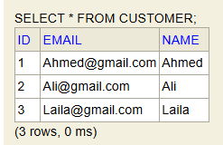
#### creation de la table Bank_account
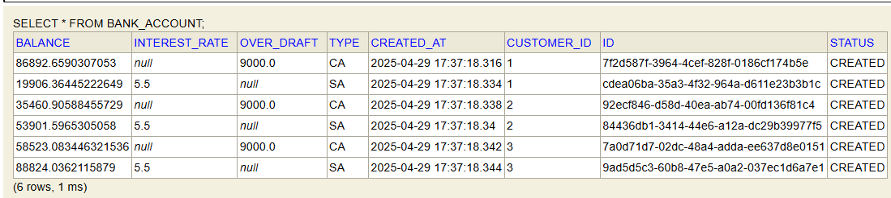
#### creation de la table Account_operation
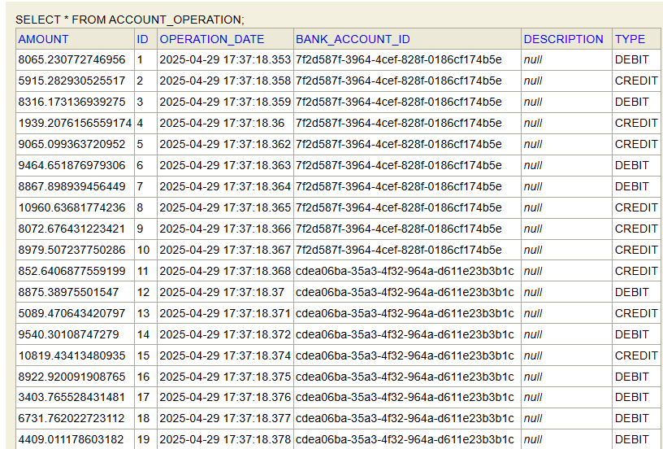

### **3- Tester la couche Services**
```java
@Bean
CommandLineRunner commandLineRunner(BankAccountService bankAccountService){
return args -> {
Stream.of("ahmed","Rim","Salama").forEach(name->{
CustomerDTO customer=new CustomerDTO();
customer.setName(name);
customer.setEmail(name+"@gmail.com");
bankAccountService.saveCustomer(customer);
});
bankAccountService.listCustomers().forEach(customer->{
try {
bankAccountService.saveCurrentBankAccount(Math.random()*90000,9000,customer.getId());
bankAccountService.saveSavingBankAccount(Math.random()*120000,5.5,customer.getId());

                } catch (CustomerNotFoundException e) {
                    e.printStackTrace();
                }
            });
            List<BankAccountDTO> bankAccounts = bankAccountService.bankAccountList();
            for (BankAccountDTO bankAccount:bankAccounts){
                for (int i = 0; i <10 ; i++) {
                    String accountId;
                    if(bankAccount instanceof SavingBankAccountDTO){
                        accountId=((SavingBankAccountDTO) bankAccount).getId();
                    } else{
                        accountId=((CurrentBankAccountDTO) bankAccount).getId();
                    }
                    bankAccountService.credit(accountId,10000+Math.random()*120000,"Credit");
                    bankAccountService.debit(accountId,1000+Math.random()*9000,"Debit");
                }
            }
            System.out.println(bankAccountService.listCustomers());
        };
    }
```
### **4- Resultat de test*
#### la liste des customers : 
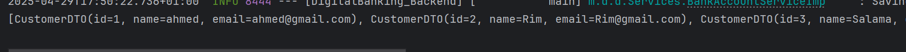

### **5- RESTController**
```java
@RestController
@AllArgsConstructor
@Slf4j
@CrossOrigin("*")
public class CustomerRestController {
    private BankAccountService bankAccountService;
    //liste des Customers
    @GetMapping("/customers")
    public List<CustomerDTO> customers(){
        return bankAccountService.listCustomers();
    }
    //search un customer By name
    @GetMapping("/customers/search")
    public List<CustomerDTO> searchCustomers(@RequestParam(name = "keyword",defaultValue = "") String keyword){
        return bankAccountService.searchCustomers("%"+keyword+"%");
    }
    
    @GetMapping("/customers/{id}")
    public CustomerDTO getCustomer(@PathVariable(name = "id") Long customerId) throws CustomerNotFoundException {
        return bankAccountService.getCustomer(customerId);
    }
    //save customer
    @PostMapping("/customers")
    public CustomerDTO saveCustomer(@RequestBody CustomerDTO customerDTO){
        return bankAccountService.saveCustomer(customerDTO);
    }
    //mise a jour de customer
    @PutMapping("/customers/{customerId}")
    public CustomerDTO updateCustomer(@PathVariable Long customerId, @RequestBody CustomerDTO customerDTO){
        customerDTO.setId(customerId);
        return bankAccountService.updateCustomer(customerDTO);
    }
    //suprimer un customer
    @DeleteMapping("/customers/{id}")
    public void deleteCustomer(@PathVariable Long id){
        bankAccountService.deleteCustomer(id);
    }
}
```
### **6- Resultat de test**
#### la liste des customers :
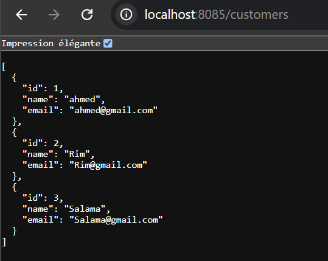
####  afficher le customer dans ID=1
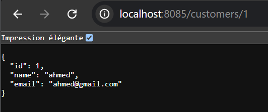

### **7- BankAccountRestAPI**
```java

@RestController
@CrossOrigin("*")
public class BankAccountRestAPI {
    private BankAccountService bankAccountService;

    public BankAccountRestAPI(BankAccountService bankAccountService) {
        this.bankAccountService = bankAccountService;
    }

    @GetMapping("/accounts/{accountId}")
    public BankAccountDTO getBankAccount(@PathVariable String accountId) throws BankAccountNotFoundException {
        return bankAccountService.getBankAccount(accountId);
    }
    @GetMapping("/accounts")
    public List<BankAccountDTO> listAccounts(){
        return bankAccountService.bankAccountList();
    }
    @GetMapping("/accounts/{accountId}/operations")
    public List<AccountOperationDTO> getHistory(@PathVariable String accountId){
        return bankAccountService.accountHistory(accountId);
    }

    @GetMapping("/accounts/{accountId}/pageOperations")
    public AccountHistoryDTO getAccountHistory(
            @PathVariable String accountId,
            @RequestParam(name="page",defaultValue = "0") int page,
            @RequestParam(name="size",defaultValue = "5")int size) throws BankAccountNotFoundException {
        return bankAccountService.getAccountHistory(accountId,page,size);
    }
    @PostMapping("/accounts/debit")
    public DebitDTO debit(@RequestBody DebitDTO debitDTO) throws BankAccountNotFoundException, BalanceNotSufficientException {
        this.bankAccountService.debit(debitDTO.getAccountId(),debitDTO.getAmount(),debitDTO.getDescription());
        return debitDTO;
    }
    @PostMapping("/accounts/credit")
    public CreditDTO credit(@RequestBody CreditDTO creditDTO) throws BankAccountNotFoundException {
        this.bankAccountService.credit(creditDTO.getAccountId(),creditDTO.getAmount(),creditDTO.getDescription());
        return creditDTO;
    }
}
   
```
### **8- Resultat de test**
#### la liste des comptes :
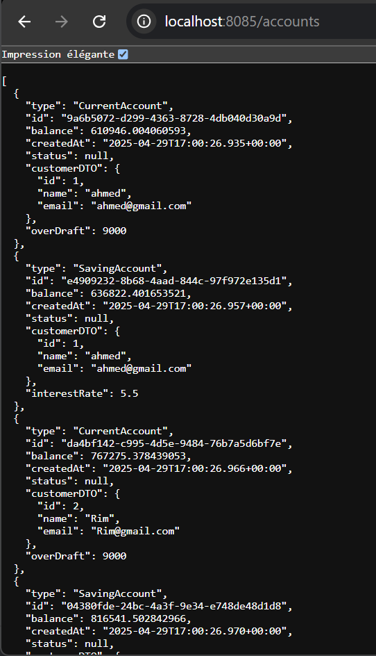

#### le compte dans ID=e4909232-8b68-4aad-844c-97f972e135d1:
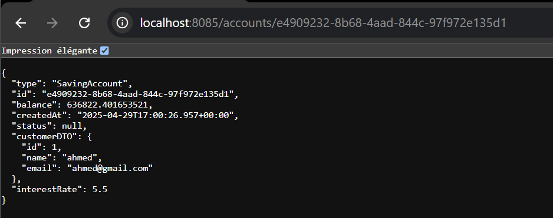
#### test avec swagger-ui
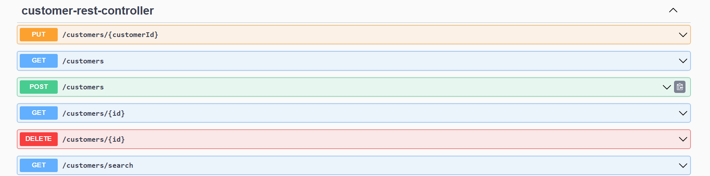

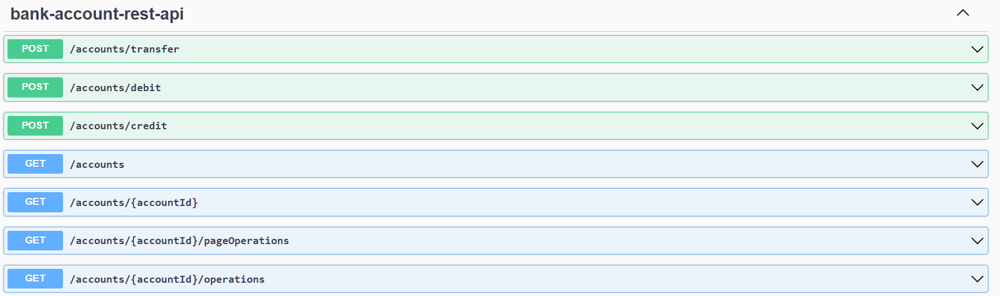

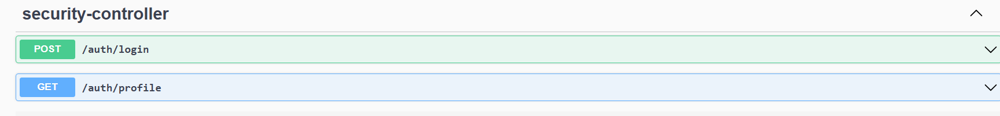

## **Sécurity**
